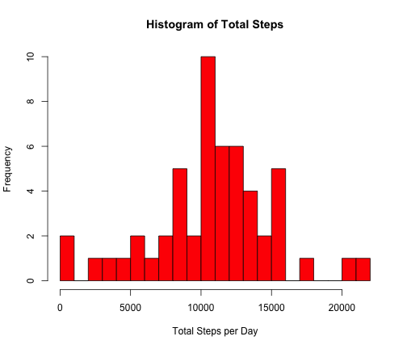
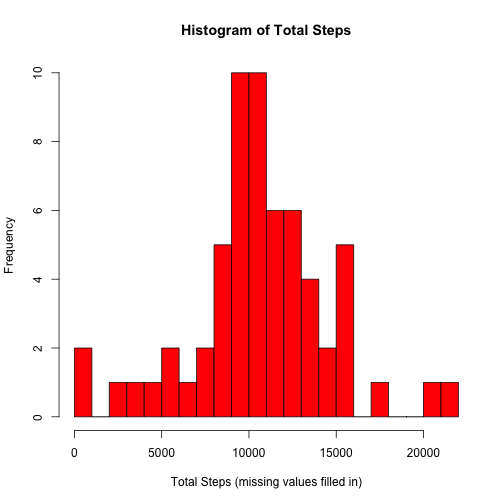
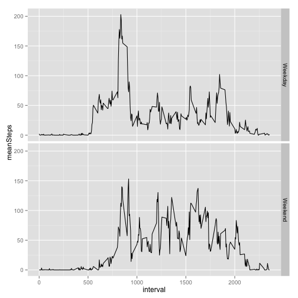

Analysis of Activity Monitoring Data
========================================================

To begin the analysis, we first load the required libraries and the CSV file into R. 


```r
library(lubridate)
library(plyr)
library(ggplot2)
activityData <- read.csv("activity.csv", colClasses = c("numeric", "Date", "numeric"))
```

```
## Warning: cannot open file 'activity.csv': No such file or directory
```

```
## Error: cannot open the connection
```

```r
actiData <- na.omit(activityData)
```


To explore the data a bit, we make a histogram of the total number of steps taken each day and also calculate and report the mean and median total number of steps taken per day.


```r
## First we plot the Histogram
actiHist <- ddply(actiData, "date", summarise, stepSum = sum(steps))
hist(actiHist$stepSum, breaks = 30, col = "red", xlab = "Total Steps per Day", 
    main = "Histogram of Total Steps")
```

 


Then we generate the mean and median steps per day


```r
# In the SummaryActivity dataframe, the meanSteps and medianSteps colums
# show the data for the corresponding day.
summaryActivity <- ddply(actiData, "date", function(x) {
    mean <- mean(x$steps)
    median <- median(x$steps)
    data.frame(meanSteps = mean, medianSteps = median)
})
summaryActivity
```

```
##          date meanSteps medianSteps
## 1  2012-10-02    0.4375           0
## 2  2012-10-03   39.4167           0
## 3  2012-10-04   42.0694           0
## 4  2012-10-05   46.1597           0
## 5  2012-10-06   53.5417           0
## 6  2012-10-07   38.2465           0
## 7  2012-10-09   44.4826           0
## 8  2012-10-10   34.3750           0
## 9  2012-10-11   35.7778           0
## 10 2012-10-12   60.3542           0
## 11 2012-10-13   43.1458           0
## 12 2012-10-14   52.4236           0
## 13 2012-10-15   35.2049           0
## 14 2012-10-16   52.3750           0
## 15 2012-10-17   46.7083           0
## 16 2012-10-18   34.9167           0
## 17 2012-10-19   41.0729           0
## 18 2012-10-20   36.0938           0
## 19 2012-10-21   30.6285           0
## 20 2012-10-22   46.7361           0
## 21 2012-10-23   30.9653           0
## 22 2012-10-24   29.0104           0
## 23 2012-10-25    8.6528           0
## 24 2012-10-26   23.5347           0
## 25 2012-10-27   35.1354           0
## 26 2012-10-28   39.7847           0
## 27 2012-10-29   17.4236           0
## 28 2012-10-30   34.0938           0
## 29 2012-10-31   53.5208           0
## 30 2012-11-02   36.8056           0
## 31 2012-11-03   36.7049           0
## 32 2012-11-05   36.2465           0
## 33 2012-11-06   28.9375           0
## 34 2012-11-07   44.7326           0
## 35 2012-11-08   11.1771           0
## 36 2012-11-11   43.7778           0
## 37 2012-11-12   37.3785           0
## 38 2012-11-13   25.4722           0
## 39 2012-11-15    0.1424           0
## 40 2012-11-16   18.8924           0
## 41 2012-11-17   49.7882           0
## 42 2012-11-18   52.4653           0
## 43 2012-11-19   30.6979           0
## 44 2012-11-20   15.5278           0
## 45 2012-11-21   44.3993           0
## 46 2012-11-22   70.9271           0
## 47 2012-11-23   73.5903           0
## 48 2012-11-24   50.2708           0
## 49 2012-11-25   41.0903           0
## 50 2012-11-26   38.7569           0
## 51 2012-11-27   47.3819           0
## 52 2012-11-28   35.3576           0
## 53 2012-11-29   24.4688           0
```


To get a sense of the daily activity pattern, we plot a time series plot of the 5-minute interval (x-axis) and the average number of steps taken, averaged across all days (y-axis)


```r
stepInterval <- ddply(activityData, "interval", function(x) {
    sumInterval <- sum(x$steps, na.rm = TRUE)
    lengthInt <- count(x$interval)
    aveStep <- sumInterval/lengthInt
})
stepsInterval <- data.frame(interval = stepInterval$interval, MeanSteps = stepInterval$freq)
plot(stepsInterval$interval, stepsInterval$MeanSteps, type = "l")
```

 

```r
# To compute the interval with the maximum number of steps
maxSteps <- stepsInterval[which(stepsInterval$MeanSteps == max(stepsInterval$MeanSteps)), 
    1]
```

The 5-minute interval with the maximum number of steps is 835.

In order to get analyse the data with consideration for missing data, we try to impute values for data that are 'NA'


```r
## How many rows have missing data?
stepsNA <- length(which(is.na(activityData$steps)))

## To complete the missing data('fill in blanks'), we use the following rule:
## for each interval that we do not have a step count, impute a value equal
## to ##average for that interval accross all the days for which we captured
## data.

activityData$compSteps <- ifelse(is.na(activityData$step), stepsInterval$MeanSteps, 
    activityData$step)

activityHist <- ddply(activityData, "date", summarise, compSteps = sum(compSteps))

hist(activityHist$compSteps, breaks = 30, col = "red", xlab = "Total Steps (missing values filled in)", 
    main = "Histogram of Total Steps")
```

 

```r

meanComp <- mean(activityHist$compSteps)

medianComp <- median(activityHist$compSteps)

medianInc <- median(actiHist$stepSum)

meanInc <- mean(actiHist$stepSum)
```


The total number of missing values is 2304. The mean and median for the dataset with NA values filled in is 1.0581 &times; 10<sup>4</sup> and 1.0395 &times; 10<sup>4</sup> and compares with 1.0766 &times; 10<sup>4</sup> and 1.0765 &times; 10<sup>4</sup> with missing values. Note that to complete the missing values we imputeed a value equal to the average for that interval accross all the days for which we captured data.

Lastly, to investigate if there are differences in activity patterns between weekdays and weekends, we make a panel plot containing a time series plot (i.e. type = "l") of the 5-minute interval (x-axis) and the average number of steps taken, averaged across all weekday days or weekend days (y-axis


```r
daf <- wday(activityData$date)
activityData$day <- factor(ifelse(daf == 1 | daf == 7, "Weekend", "Weekday"))

pattern <- ddply(activityData, c("interval", "day"), function(x) {
    sumInterval <- sum(x$steps, na.rm = TRUE)
    lengthInt <- count(x$interval)
    aveStep <- sumInterval/lengthInt
})
stepsDoW <- data.frame(interval = pattern$interval, day = pattern$day, meanSteps = pattern$freq)
p <- ggplot(stepsDoW, aes(x = interval, y = meanSteps)) + geom_line()
p + facet_grid(day ~ .)
```

 


The grpghs show that the general pattern is similar for both weekdays and weekends, but that the weekday average steps are higher than the weekends'.


